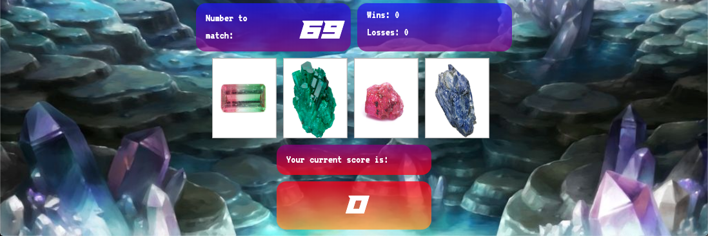
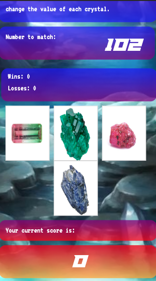

# Crystal Collector

Get ready to test your memorization skills with Crystal Collector! This game requires you to associates shapes, colors and patterns to each other in order to win!

## Getting Started

Want to try it out?
Just follow this link: [Crystal Collector](https://ctslone.github.io/unit-4-game/)

## Mobile Friendly

With this being a game, one of my goals was to make it mobile friendly so users could play it anytime at their own convenience, without being locked to a desktop or laptop.

Feel free to open the app on your favorite mobile device or use the developer tools in your favorite browser to view the mobile layout!

## Challenges

A few challenges that I faced when creating this game were:
* Having the current score number increase by the amount of whichever crystal the user clicks, instead of adding all previous values plus the newest clicked value.
  * My solution to this was a global counter variable that was updated to the current counter value plus whatever the value of the clicked crystal is (+=).
* Figuring out how to assign each crystal a new number at the start of each new game.
  * I solved this by using a forEach loop on each of the crystal buttons and using keyword "this" to assign a random number to each iteration (each button).

## Built With

* [Bootstrap](https://bootstrap.com) - The CSS framework used for layout formatting and design.
* [jQuery](https://jquery.com/ ) - JavaScript library used for logic and calculations.

## Authors

* Charlie Slone
    * [GitHub](https://github.com/ctslone)
    * [LinkedIn](https://www.linkedin.com/in/charlie-slone-704311a9/)
    * [Portfolio](https://ctslone.github.io/Updated-Portfolio/)
